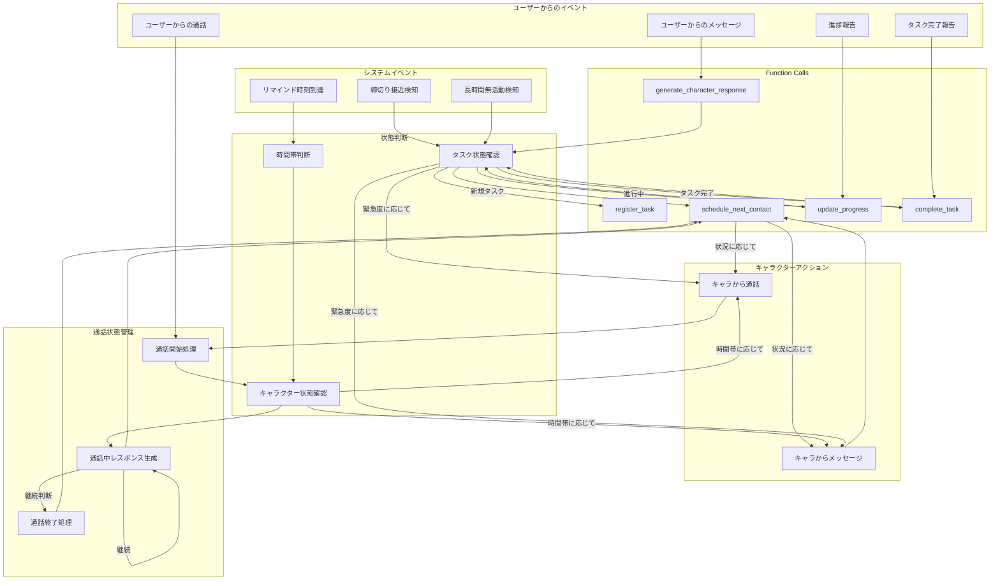
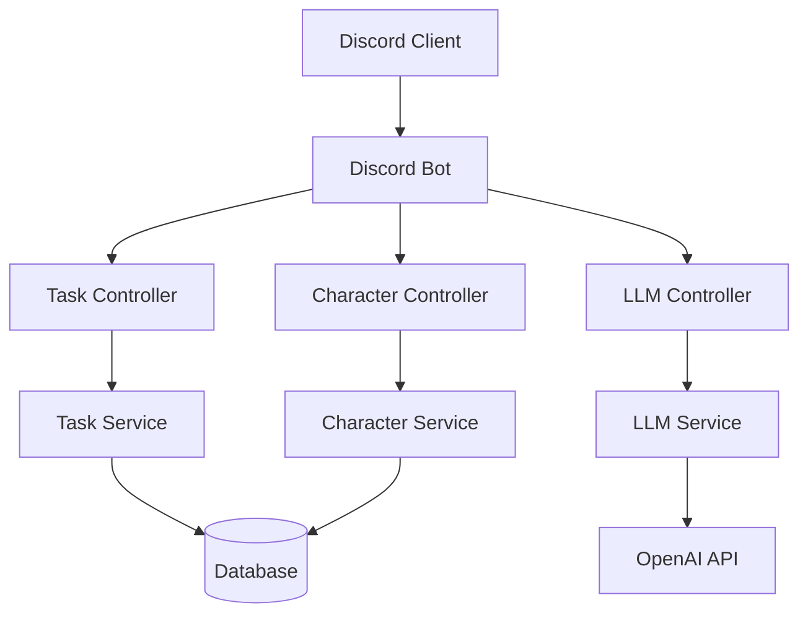

# システム設計書

## システムアーキテクチャ

### 全体フロー図



### コンポーネント構成図



## 主要コンポーネント

### 1. Discord Bot基盤
- discord.jsを使用
- イベントハンドリング
- コマンド管理

### 2. 機能別サービス
- TaskService: タスク管理ロジック
- CharacterService: キャラクター管理
- LLMService: OpenAI API連携

### 3. データストア
- 開発: SQLite
- 本番: PlanetScale

## API設計

### 内部API
```typescript
interface TaskService {
  createTask(data: TaskInput): Promise<Task>
  updateProgress(id: string, progress: number): Promise<Task>
  completeTask(id: string): Promise<Task>
}

interface CharacterService {
  getResponse(context: Context): Promise<Response>
  adjustPressure(level: number): void
}
```

### 外部API連携
- Discord API
- OpenAI API
- （将来）Slack API