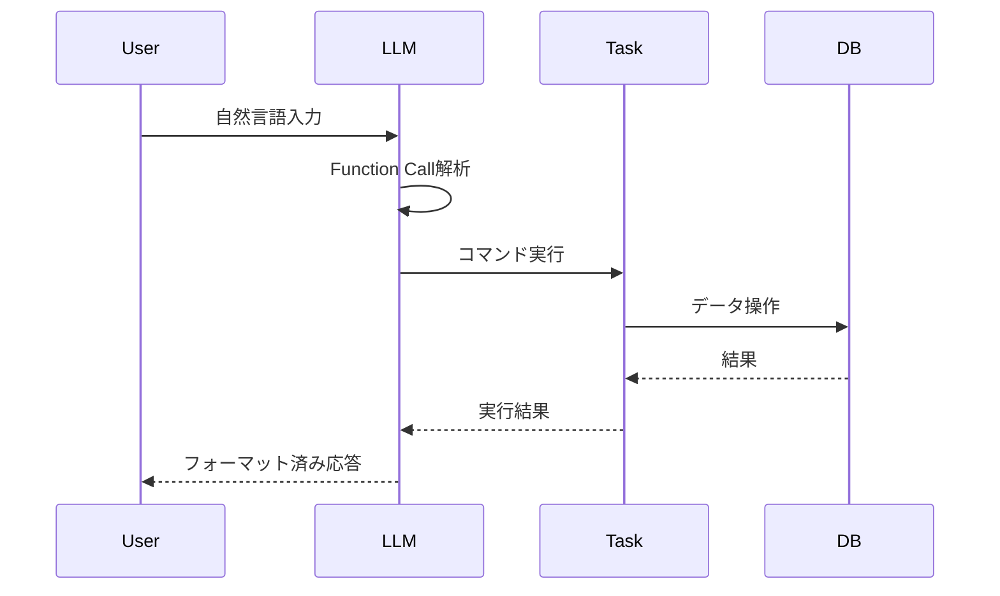
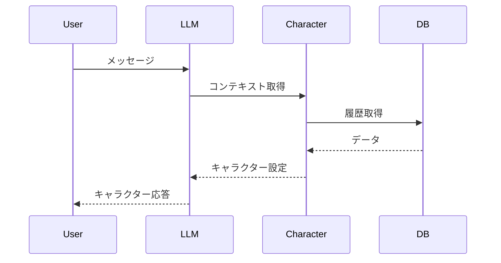
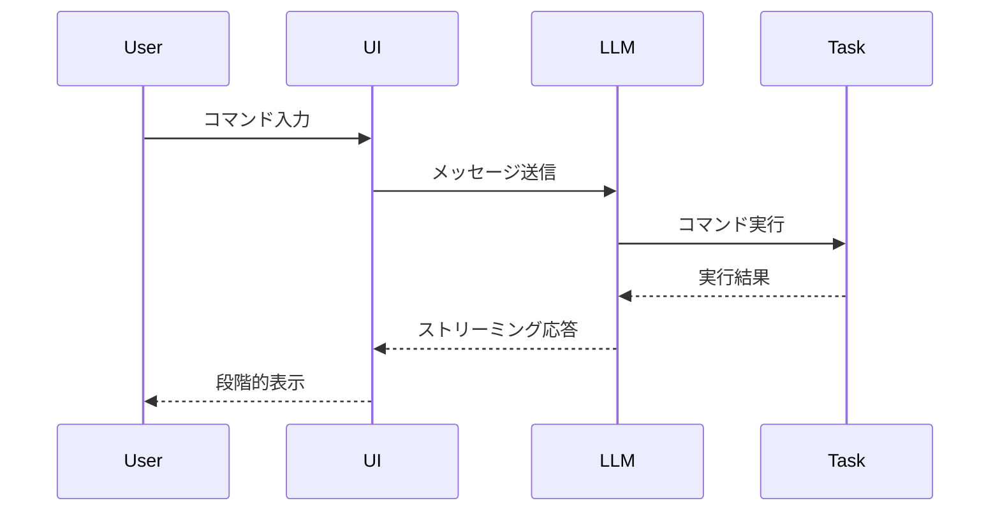

# チーム間依存関係

## 1. 依存関係図

## 2. チーム間連携ポイント

### 2.1 UI ⇔ タスク管理
- タスク表示コンポーネントのデータ構造
- 進捗更新時のUI更新
- フォームバリデーション

### 2.2 UI ⇔ キャラクター
- キャラクターの視覚表現
- メッセージ表示フォーマット
- アニメーション・エフェクト

### 2.3 タスク管理 ⇔ LLM
- タスクコマンドの解釈
- 自然言語からのタスク抽出
- Function Callingインターフェース

### 2.4 キャラクター ⇔ LLM
- キャラクター口調の生成
- プロンプトテンプレート
- 文脈理解と応答生成

### 2.5 全チーム ⇔ インフラ
- データベースアクセス
- 環境変数管理
- ログ収集・モニタリング

## 3. 開発優先順位

1. **フェーズ1: 基盤構築**
   - インフラチーム: DB設計、基本環境構築
   - タスク管理チーム: コアロジック実装
   - UIチーム: 基本コンポーネント

2. **フェーズ2: 機能拡張**
   - キャラクターチーム: 基本キャラ実装
   - LLMチーム: OpenAI連携基盤
   - UIチーム: インタラクション追加

3. **フェーズ3: 統合・最適化**
   - 全チーム: 機能統合
   - パフォーマンス最適化
   - UX改善

## 4. コミュニケーションガイドライン

### 4.1 定例ミーティング
- 週次進捗報告
- チーム間同期
- 技術的な課題の共有

### 4.2 ドキュメント更新
- 仕様変更時の共有
- APIドキュメントの更新
- 依存関係の変更通知

### 4.3 コードレビュー
- チームを跨ぐレビュー体制
- インターフェース変更時の確認
- パフォーマンスレビュー

## 5. リスク管理

### 5.1 依存関係によるリスク
- チーム間のブロッカー発生
- インターフェース不整合
- パフォーマンスボトルネック

### 5.2 対策
- 早期のインターフェース定義
- モックの活用
- 定期的な依存関係の見直し

## 6. チーム間連携の詳細

### 6.1 LLMチーム ⇔ タスク管理チーム

#### 6.1.1 Function Calling
- タスクコマンドの解釈
- 日付・優先度の解析
- タスク管理APIの呼び出し

#### 6.1.2 データフロー

### 6.2 LLMチーム ⇔ キャラクターチーム

#### 6.2.1 キャラクター応答生成
- キャラクター設定の反映
- プレッシャーレベルの調整
- 応答の一貫性管理

#### 6.2.2 インタラクションフロー

### 6.3 LLMチーム ⇔ UIチーム

#### 6.3.1 メッセージ表示
- ストリーミング応答の表示
- エラーメッセージの整形
- デバッグ情報の表示

#### 6.3.2 インタラクション管理
