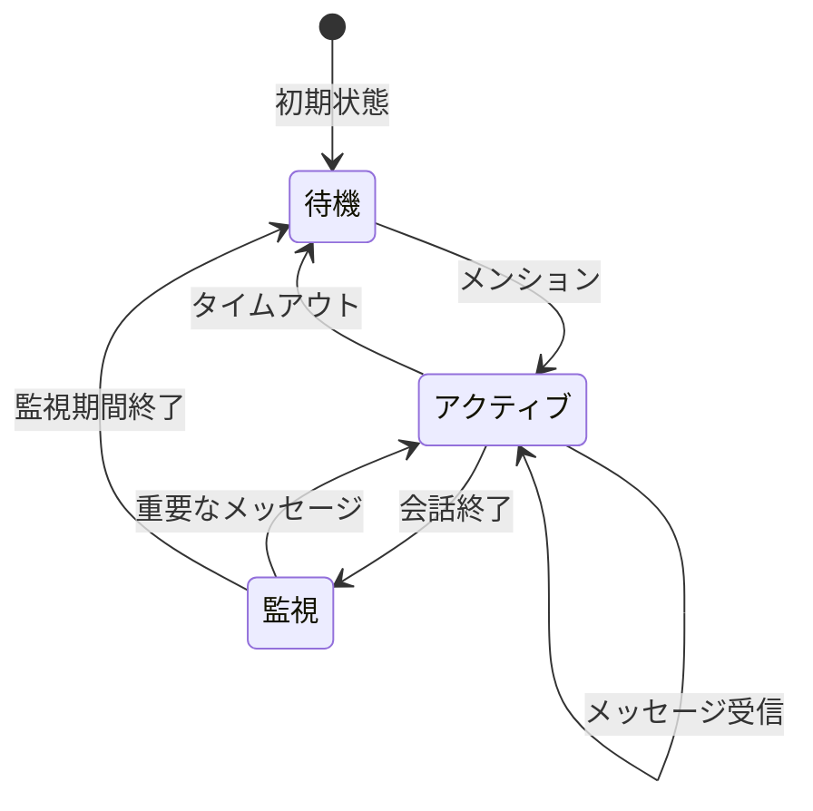

# キャラクター機能仕様書

## 1. 概要

キャラクターの管理、会話履歴の管理、対話生成、プレッシャー制御を行う機能の実装仕様です。

## 2. コンポーネント構成

### 2.1 キャラクター基本機能
```typescript
interface Character {
  id: string;
  name: string;
  basePersonality: string;
  pressureLevel: number;
  specialAbility?: string;
}
```

### 2.2 会話管理
```typescript
interface ConversationContext {
  character: {
    id: string;
    name: string;
    pressureLevel: number;
    relationshipScore: number;
  };
  currentTask?: {
    title: string;
    progress: number;
    deadline?: Date;
  };
  recentMessages: {
    role: 'user' | 'assistant' | 'tool' | 'system';
    content: string;
  }[];
}
```

### 2.3 データ構造
- Conversation: 会話セッション管理
- ConversationMessage: 個々のメッセージ管理
- ユーザー・タスクとの関連付け

## 3. 会話管理システム

### 3.1 会話のライフサイクル


### 3.2 状態の定義
- **待機状態**
  - メンションのみに反応
  - 他のメッセージは無視

- **アクティブ状態**
  - すべてのメッセージに反応
  - 10分間のメッセージ無しでタイムアウト
  - Function Callingによる自然な会話終了判定

- **監視状態**
  - 10分間の監視期間
  - メッセージの重要度を判断
  - 必要な場合のみ応答

### 3.3 状態遷移条件
1. **アクティブ化条件**
   - メンションを受信
   - 監視中の重要メッセージ検出

2. **終了判定条件**
   ```typescript
   - 会話の論理的な結論到達
   - 新しい話題導入の可能性が低い
   - ユーザーの質問に十分な対応完了
   ```

3. **タイムアウト条件**
   - 10分間のメッセージ無し
   - システムメッセージで明示的に通知

### 3.4 会話の質の制御
1. **メッセージ重要度判定**
   - 直接的な質問や相談の有無
   - ユーザーの支援必要性
   - タスク関連情報の重要度

2. **コンテキスト管理**
   - 会話履歴の保持
   - キャラクター設定の一貫性
   - プレッシャーレベルの反映

3. **応答生成制御**
   - キャラクター性の維持
   - 適切な終了タイミングの判断
   - 自然な会話の継続

## 4. キャラクター設定

### レイナ（完璧主義お嬢様）
- プレッシャーレベル: 3/5
- 特殊能力: 完璧な進捗管理（計画中）
- メッセージパターン: 高飛車、完璧主義

### 佐伯（フリーランス先輩）
- プレッシャーレベル: 4/5
- 特殊能力: 業界アドバイス（計画中）
- メッセージパターン: 実践的、厳しめ

### 九条（闇PM）
- プレッシャーレベル: 5/5
- 特殊能力: ガントチャート生成（計画中）
- メッセージパターン: 威圧的、冷静

### 月城（メンタリスト）
- プレッシャーレベル: 3/5
- 特殊能力: 心理分析（計画中）
- メッセージパターン: 洞察的、導くような

## 5. 実装状況

### 5.1 完了済み
- 基本的なキャラクター管理機能
- 会話履歴の保存と取得
- コンテキスト管理システム
- プレッシャーレベルの基本制御
- 関係性スコアの管理

### 5.2 実装予定
- キャラクターごとの特殊能力
- より詳細な性格パラメータ
- 状況に応じたメッセージパターン
- ムードシステムの実装

## 6. テスト要件

### 6.1 会話管理テスト
- 会話の作成と取得
- メッセージの追加
- コンテキストの構築
- プレッシャーレベルの制御

### 6.2 状態管理テスト
- 関係性スコアの更新
- 古いデータの削除
- エラー処理

## 7. 今後の展開

### 7.1 優先実装項目
1. キャラクターごとの特殊能力実装
2. メッセージパターンの多様化
3. ムードシステムの実装

### 7.2 改善項目
- プロンプトの最適化
- キャラクター性の一貫性向上
- パフォーマンスの最適化