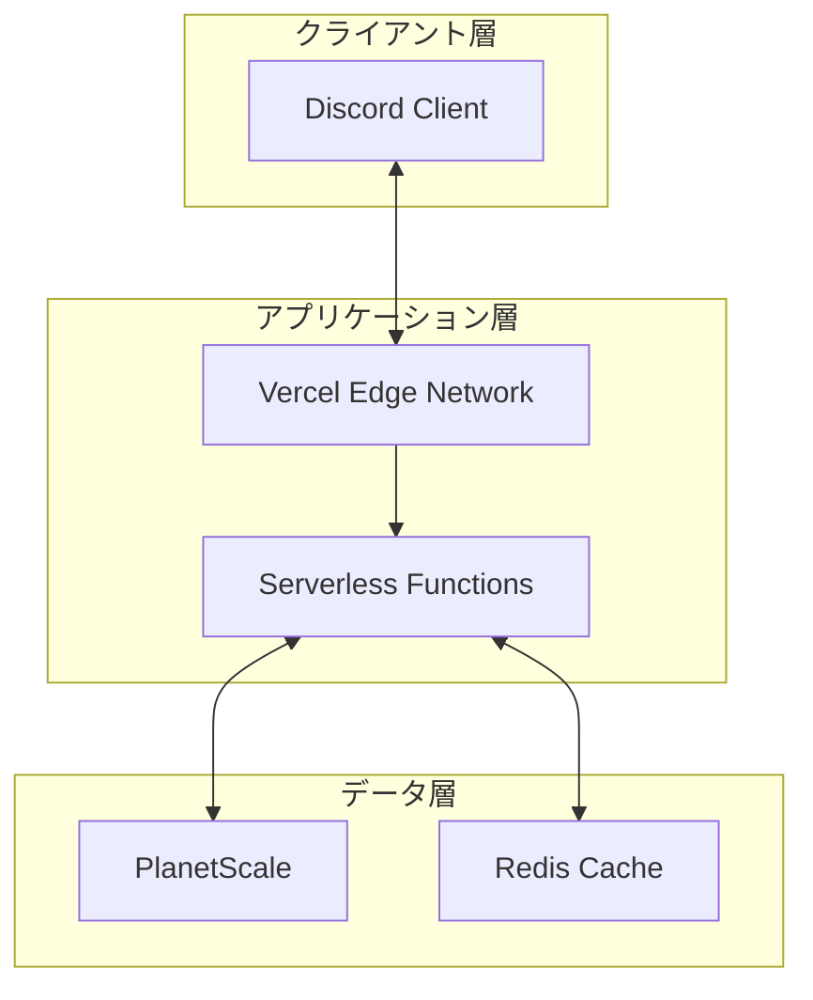

# デプロイメント仕様書

## 1. 開発環境

### 1.1 必要要件
- Node.js v18以上
- pnpm
- Git

### 1.2 初期セットアップ
```bash
# リポジトリのクローン
git clone https://github.com/your-org/dska-bot.git
cd dska-bot

# 依存関係のインストール
pnpm install

# 環境変数の設定
cp .env.example .env

# データベースのセットアップ
pnpm prisma generate
pnpm prisma db push

# 開発サーバー起動
pnpm dev
```

## 2. デプロイメントフロー（予定）

### 2.1 CI/CD パイプライン
```yaml
name: Deploy
on:
  push:
    branches: [main]
  pull_request:
    branches: [main]

jobs:
  test:
    runs-on: ubuntu-latest
    steps:
      - uses: actions/checkout@v2
      - uses: pnpm/action-setup@v2
      - name: Test
        run: |
          pnpm install
          pnpm test
          pnpm lint

  deploy:
    needs: test
    if: github.ref == 'refs/heads/main'
    steps:
      - name: Deploy to Vercel
        uses: vercel/actions/deploy@v1
```

### 2.2 デプロイメントステージ
1. 開発環境（ローカル）
2. ステージング環境（検証用）
3. 本番環境（Vercel）

## 3. インフラストラクチャ

### 3.1 本番環境構成


### 3.2 環境変数管理
- 開発環境: .env.local
- ステージング: Vercel Project Settings
- 本番環境: Vercel Production Env

## 4. スケーリング戦略

### 4.1 アプリケーション
- Vercelの自動スケーリング
- Edge Functionsの活用
- キャッシュ戦略

### 4.2 データベース
- PlanetScaleのオートスケーリング
- コネクションプール最適化
- Read Replicasの検討

## 5. モニタリング

### 5.1 アプリケーション監視
- Vercelダッシュボード
- エラーレート
- レスポンスタイム

### 5.2 データベース監視
- クエリパフォーマンス
- コネクション状態
- ストレージ使用量

## 6. 障害対策

### 6.1 バックアップ
- データベース自動バックアップ
- 設定ファイルの管理
- リストア手順の整備

### 6.2 フェイルオーバー
- 複数リージョン配置
- 自動フェイルオーバー
- 障害復旧手順

## 7. セキュリティ

### 7.1 アクセス制御
- Discord Botトークン管理
- データベースアクセス制限
- 環境変数の暗号化

### 7.2 監査
- デプロイログ
- アクセスログ
- セキュリティスキャン

## 8. 今後の実装計画

### 8.1 優先度高
- [ ] GitHub Actions CI/CD設定
- [ ] 本番環境変数の設定
- [ ] デプロイメントテスト

### 8.2 優先度中
- [ ] モニタリング設定
- [ ] バックアップ自動化
- [ ] アラート設定

### 8.3 優先度低
- [ ] パフォーマンスチューニング
- [ ] コスト最適化
- [ ] 災害復旧計画